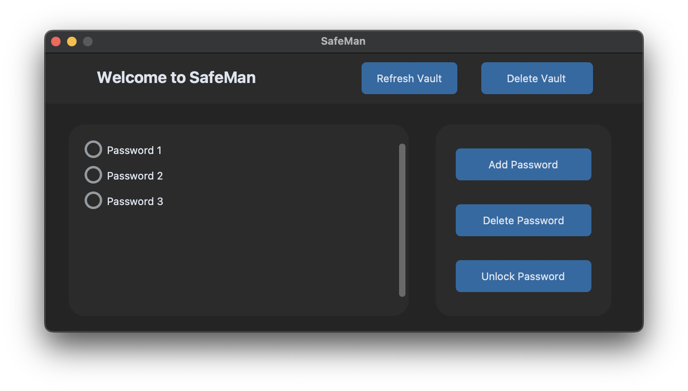

<h1> SafeMan - a simple password manager application </h1>

SafeMan application is a local password manager for UNIX based systems and has been developed for coding practice purposes. 

SafeMan provides an easy user interface to save and manage your passwords. In terms security, SafeMan application utilises gnupg encryption-decryption.


| _Main menu of SafeMan_
###

## Required Packages
Install required packages with pip:
```
pip3 install customtkinter
pip3 install python-gnupg
```

## Installation
Once you have installed the required packages head to the directory and run the Makefile:
```
sudo make install
```
Lastly, please add the following alias below to your .bashrc or .zshrc file:
```
alias SafeMan='/usr/local/lib/safeman/SafeMan.bash'
```
Now you can open the command line and run the application by only typing:
```
SafeMan
```

## Unistallation
If you want to delete SafeMan, type to command line:
```
sudo make uninstall
```
Lastly, don't forget to delete the alias you have put in your .bashrc or .zshrc file.

<h3>Have fun using SafeMan :D</h3>
